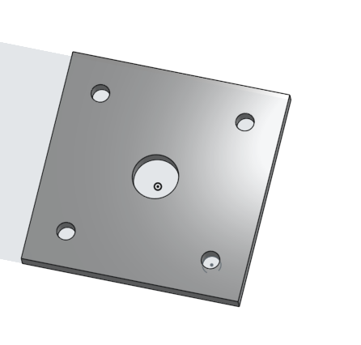

# BasicCAD

We are creating a caster.

---
## Table of Contents
* [Table of Contents](#Table-of-Contents)
* [Base](#Base)
* [Mount](#Mount)
* [Fork](#Fork)
* [Tire](#Tire)
* [Wheel](#Wheel)
* [AxleCollarBearings](#AxleCollarBearings)

## Base

### Description

The first assignment is to create the caster base.  The base's dimensions are 200 mm x 120 mm and 8 mm thick.  It has 6 holes 10 mm wide and 20 mm from the edge equally spaced along the edges.

### Evidence
[The Base in Onshape](https://cvilleschools.onshape.com/documents/0d70f655203ca304cb3c5b7d/w/f55603f962f6fc74f5548a68/e/41d730c570a8d75fce9f51b6)

### Image

### Reflection

This was my first Onshape part and [following along with Dr. Shields made it super easy.](https://www.youtube.com/watch?v=93BFUD-HAG8&feature=emb_title&scrlybrkr=5670f0b4)  I learned about 
* sketching (shortcut **shift-s**)
* constructions lines (shortcut **Q**)
* dimensions (shortcut **D**)
* extruding both add and remove (shortcut key **E**)
* linear patterns (no shortcut)

Onshape is awesome.  I found it really helpful to rename all my sketches.  It is going to be a GREAT year in engineering.

---

## Mount

### Description

For the mount I needed to create four 6mm holes and the same big hole in the center as the caster base. The mount needed to be square and rest on top of the base.

### Evidence
https://cvilleschools.onshape.com/documents/7588c139f3599d22dc53e4e0/w/f600bef70e9890d7aaff78dd/e/dfe730a2a2440096b336cc3a

### Image

### Reflection

For the Caster I started by following the video with Mr. Sheilds https://youtu.be/BWDk4BZFXDQ but then Mr. Hemstetter told me an easier way to do it. He told me that I could use project convert (shortcut **u**) to make a new sketch(shortcut **shift-s**) on the same document and make the mount a much easier way. I learned that you can make a new project in the same document.

---

## Fork

### Description

For the fork I had to create a extruded circle with two forks and a shaft. I also had to create fillet and chamfers to blend the components together

### Evidence
https://cvilleschools.onshape.com/documents/7588c139f3599d22dc53e4e0/w/f600bef70e9890d7aaff78dd/e/dfe730a2a2440096b336cc3a

### Image

### Reflection

For the fork I used learned about the chamfer and the fillet (shortcut **shift-s**) I also learned about creating a shaft. I had a little trouble figuring out on which area to create the shaft but I used Mr. Sheild's video https://youtu.be/wQlTfOw8rYQ to help me figure it out.

---

## Tire

### Description

For the tire I needed to create a trapazoid sketch and rotate it aroung the axis. After I did that I needed to create 8mm fillets to make it look more round like a tire.

### Evidence
https://cvilleschools.onshape.com/documents/7588c139f3599d22dc53e4e0/w/f600bef70e9890d7aaff78dd/e/dfe730a2a2440096b336cc3a?

### Image

### Reflection

For the tire I didn't have a hard time doing it, but I did have to watch Dr, Sheild's video https://youtu.be/ReEGioIYSus that was pretty much it. The tire was, for me, really fun because rotation is one of my favorite features in Onshape. I learned how to use the fillet function (shortcut **shift-f**).

---

## Wheel

### Description

For the wheel we had to create one sketch, and rotate that sketch around the axis to create the base of the wheel. After that we had to create another sketch on top of the wheel using arcs to create the spokes. Then we had to create fillets to make the wheel look nice

### Evidence

https://cvilleschools.onshape.com/documents/7588c139f3599d22dc53e4e0/w/f600bef70e9890d7aaff78dd/e/dfe730a2a2440096b336cc3a

### Image

### Reflection

I had trouble making the spoke sketch but I looked at Mr Helmstetter's Video https://www.youtube.com/watch?v=DbOjDNK8Nsk&feature=emb_title and he showed me step by step how to do it. It took me longer than I anticipated but eventually I got it.

---

## AxleCollarBearings

### Description
For the axle I had to create a hollowed out cylinder with a removed extrusion on the outside. For the collar I had to create a cilinder on top of the axle and had to create a hole in the collar for a screw. For the bearing I had to create two different small hollowed out cillinders.

### Evidence

https://cvilleschools.onshape.com/documents/7588c139f3599d22dc53e4e0/w/f600bef70e9890d7aaff78dd/e/bd2eb726a93d6ed238f7beea

### Image

### Reflection

I had trouble when making the axle because i started on the wrong plane. I soon figured out thanks to Mr. Helmstetter, that in the end it doesnt matter which plane you are on. When Making the collar Dr. Sheild's video was very helpful https://youtu.be/2r7YqGuF1vY, and The bearings really helped me see how much easier Onshape is when you practice because I rememer when Those bearing would be very hard for me, and now I do them very quickly.

---

## caster assembly

### Description
For the Final caster assembly I had to mate all of the parts, including the sub assembly using revolute mates, and fasten mates, and one parallel mate. Once you mate all the peices together you need to put on four skrews connecting the mount to the base and then a nut holding the shaft of the fork in place. Then I needed ot great a pin in the bearing so it can't move around.

### Evidence
https://cvilleschools.onshape.com/documents/52cc50fbac7c72d2dace14f8/w/f817f3f1dad774b14de2741f/e/b21ed188445d74a9882b008e

## Image

## Reflection

Whe assembling the final part of the caster I used Mr. Sheild's video https://youtu.be/orcp-asikM4 which was very helpful. I first had trouble because ym internet wasn't working so onshape wasn't loading so that put me in a bit of a pestimistic mood going forward with this part. Once i got started I realized that onshape mae this very easy, and I didn't have any difficulties. I learned about the parallel mate when I did that for the first time I had a bit of trouble but after i figured it out It worked great.

## sub assembly

### Description
For the sub assembly I had to use 2 fasten mates and three revolve mates, I had to mate the wheel to the tire, and then mate the axle to the wheel and the bearings to the wheel. 

### Evidence

https://cvilleschools.onshape.com/documents/7588c139f3599d22dc53e4e0/w/f600bef70e9890d7aaff78dd/e/bd2eb726a93d6ed238f7beea

### Image

### Reflection

This assembly wasn't too hard for me and I figured out the mates pretty well. I learned the fasten mate (shortcut **m**) and the revolve mate (shortcut **m**). When I mated my axle to the wheel It was not perfectly centered the first time, but Dr. Sheild's video https://youtu.be/R4PDBd8H5h8 went over how to make it perfect. I really liked this part of making the caster.

